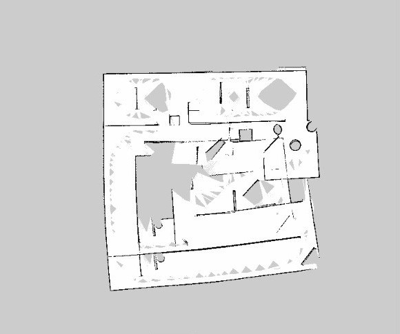

# wall-follower-controller
This ROS package was implemented for exploring a maze and constructing its map. A robot PID controller was implemented to follow walls in a maze an exploring it. Map construction is done by using *Gmapping package*.

**Final .pgm extracted map:**

